# SwiftSpend: Full-Stack Digital Wallet MVP

SwiftSpend is a modern fintech digital wallet application designed for secure peer-to-peer transfers and personal fund management. Built with a focus on **transactional integrity** and **clean architecture**, it demonstrates a robust integration between a Spring Boot backend and a Vue.js frontend.

## Tech Stack

- **Backend:** Java 21, Spring Boot 3, Spring Security (JWT), Hibernate/JPA
- **Frontend:** Vue 3 (Composition API), Pinia, Tailwind CSS, Axios
- **Database:** PostgreSQL
- **Architecture:** RESTful API with Global Exception Handling and Transactional Management

## Key Features

- **Secure Authentication:** JWT-based login with automatic session expiration handling via Axios interceptors.
- **Peer-to-Peer Transfers:** Robust transfer logic ensuring atomic operations—money is never lost or duplicated.
- **Real-time Validation:** Backend-driven form validation that maps directly to UI components for a seamless UX.
- **Financial Ledger:** Built using `BigDecimal` for precision and a structured account management system.

---

## Installation & Setup

### 1. Database Setup (Docker)

Start at the project **root**. The project includes a `docker-compose.yml` to streamline the PostgreSQL setup.

```bash
docker-compose up -d

```

### 2. Backend Configuration

Navigate to the `backend` folder and set up your environment variables:

```bash
cd backend
cp .env.example .env

```

Ensure your `.env` matches the Docker credentials:

```env
DB_URL=jdbc:postgresql://localhost:5432/swiftspend_db
DB_USERNAME=user
DB_PASSWORD=password
JWT_SECRET_KEY=your_secure_hex_string

```

Run the Spring Boot server:

```bash
./mvnw spring-boot:run

```

### 3. Frontend Configuration

In a new terminal window, navigate to the `frontend` directory:

```bash
cd frontend
npm install
npm run dev

```

---

## Engineering Highlights

### Transactional Integrity

All money movements are wrapped in `@Transactional` boundaries. This ensures that if the recipient's account fails to update, the sender's balance is automatically rolled back, preventing data inconsistency.

### Global Error Mapping

The application uses a custom `GlobalExceptionHandler` that returns `ProblemDetail` (RFC 7807) objects. This allows the Vue frontend to dynamically highlight specific form fields (like `amount` or `email`) based on backend validation errors.

### Secure API Communication

Implemented custom Axios interceptors to globally handle `401 Unauthorized` responses. If a session expires, the interceptor automatically clears the Pinia store and redirects the user to the login page, ensuring a secure and synchronized user experience.

---

## Preview & User Interface

### Landing Page
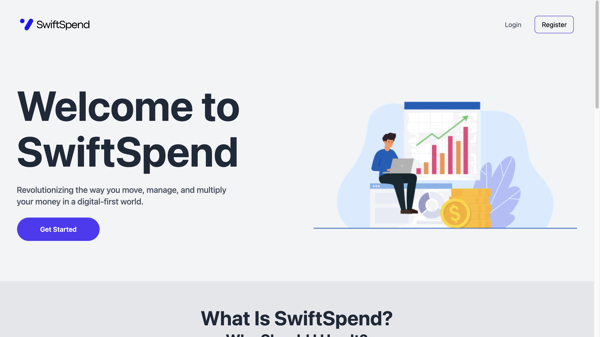
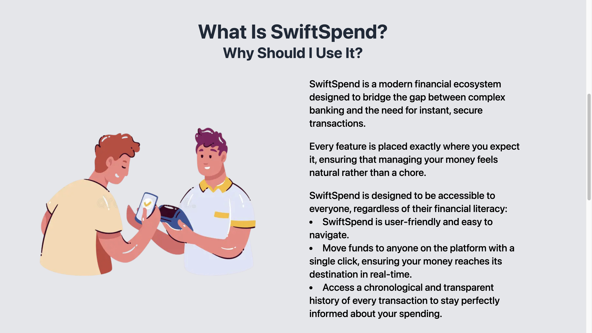


### Register and Login Page
**Secure Access**
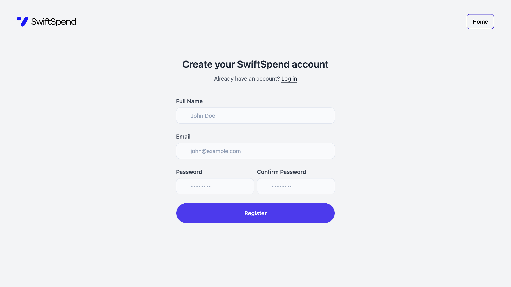
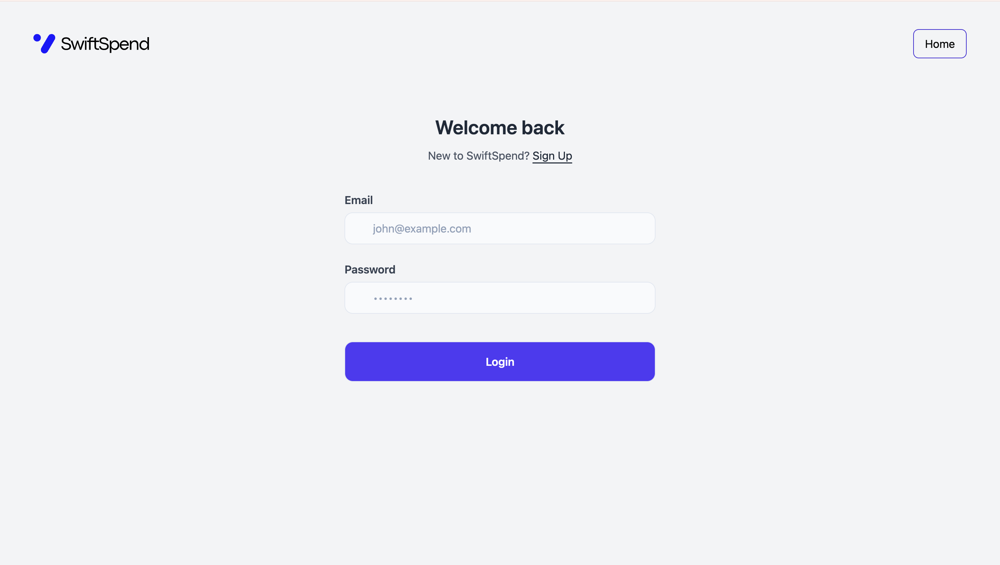

### User Dashboard & Transactions
**Personal Dashboard**
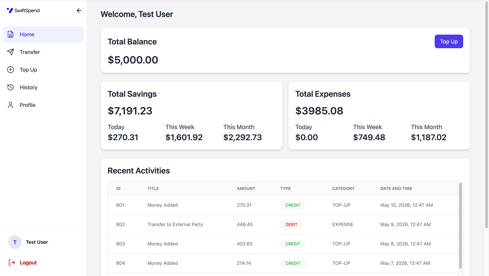

**Secure Peer-to-Peer Transfer**
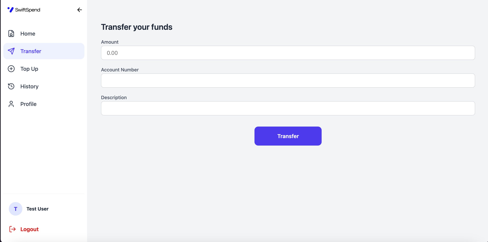

**Transaction History**
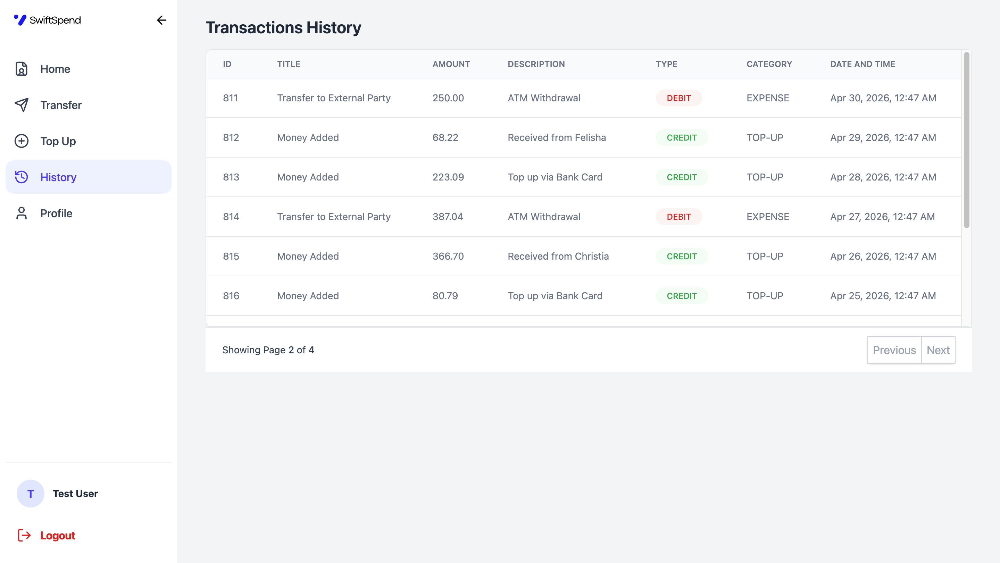

### Account Management
**Top Up Funds**
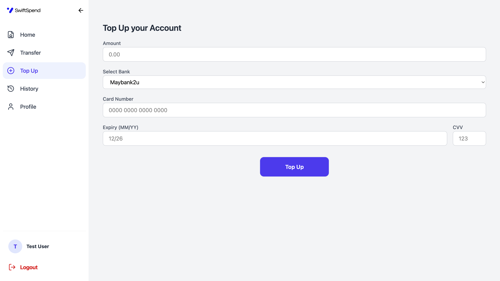

**Profile & Account Settings**
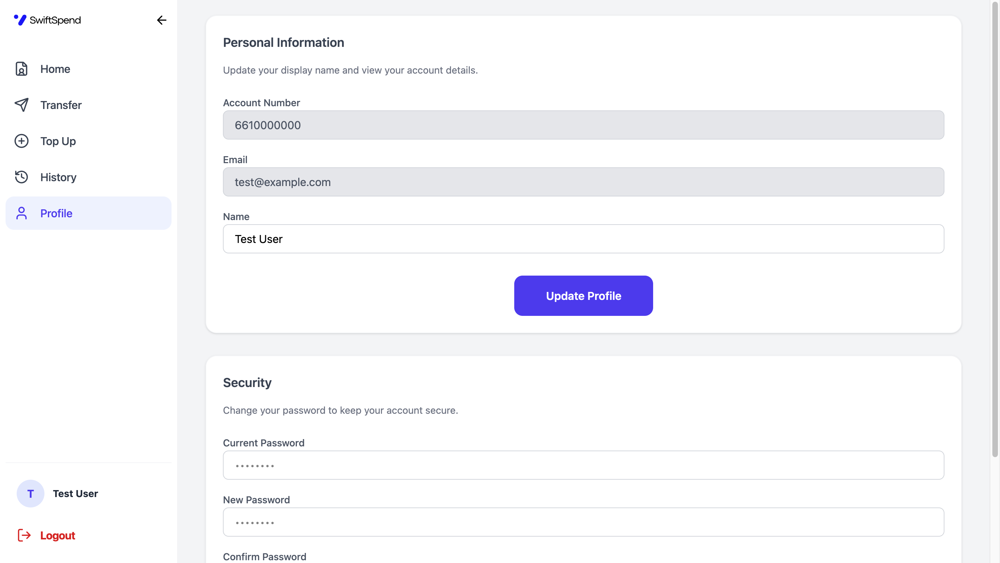

### Engineering for UX
**Mobile Responsiveness**
<div align="left">
  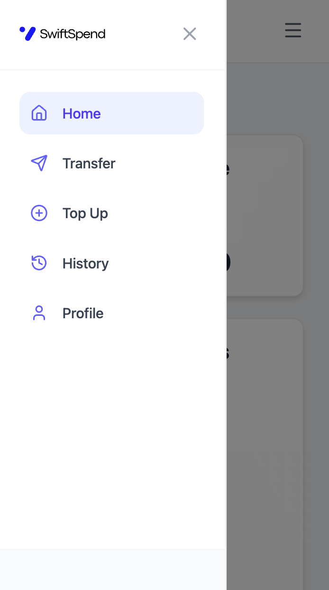
</div>

**Smart Validation & Error Handling**
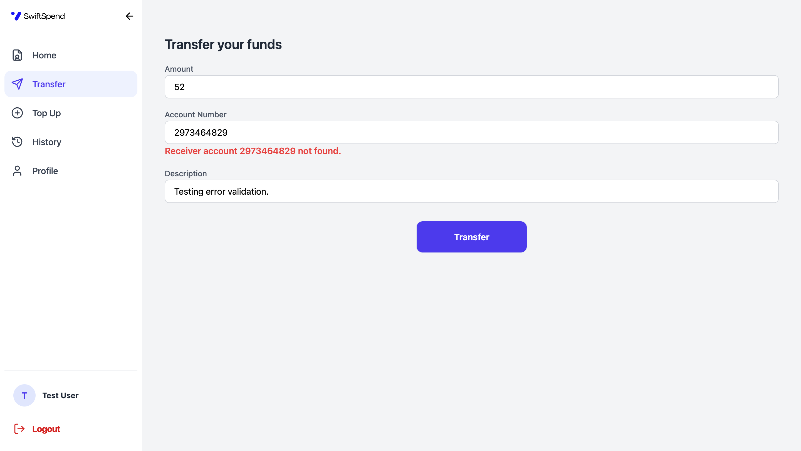

*Logic: Backend throws AccountNotFoundException → Axios Interceptor catches it → Vue component highlights the specific input field.*